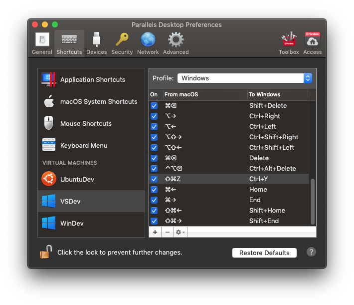

## Hakan Personal Environment

My personal environment settings and tools. To bootstrap the setup on a blank machine just run the following command:

```bash
/bin/bash -c "$(curl -fsSL https://raw.githubusercontent.com/ravero/environment/master/env-bootstrap.sh)"
```

## Suggested Setup Scripts Order

The first script to run is the `setup_network.sh` that changes the DNS settings of the adapters to Cloudfare.

First, verify that the App Store is correctly logged-in. Then run the following scripts on the suggested order.

01. [Install Terminal](setup/inst_terminal.sh)
    * Setup Shell
02. [Install Browsers](setup/inst_browsers.sh)
03. [Install Social](setup/inst_social.sh)
04. [Install Developer Tools](setup/inst_dev.sh)
05. [Install Productivity](setup/inst_productivity.sh)
06. [Install Utils](setup/inst_utils.sh)
07. [Install Media](setup/inst_media.sh)
08. [Install CLI Utils](setup/inst_cli.sh)
09. [Install Fonts](setup/inst_fonts.sh)
10. [Install Optionals](setup/inst_opts.sh)

## Other Downloads

* [Setapp](https://setapp.com): for the missing apps.
* [Visual Studio for Mac](https://visualstudio.microsoft.com/vs/mac/): the brew formula is broken, install only the IDE without any component.
* [Replacicon](https://replacicon.app/builds/Replacicon_latest.zip): doesn't have the brew formula. This is the direct download link since on the site it shows only a buying option.

## Settings

### Touch bar

My preferred touchbar settings are:


And for the expanded:


### Parallels Desktop

Paralles Desktop default key mapping is limited. As a macOS user I need to correctly map the keys that I'm used on mac to the equivalent keys on Windows. There's a table of the keys that I use:



| Atalho        | macOS     | Windows
|---------------|-----------|---------------
| Move cursor to begin of line | ⌘ + ← | Home
| Move cursor to end of line  | ⌘ + → | End
| Select text from cursor to begin of line  | ⌘ + ⇧ + ← | Shift + Home
| Select text from cursor to end linha   | ⌘ + ⇧ + → | Shift + End
| Redo       | ⌘ + ⇧ + z | Ctrl + Y
| Move to the top of the page   | ⌘ + ↑ | Ctrl + Home
| Move to the bottom of the page  | ⌘ + ↓ | Ctrl + End

Besides that, starting Parallels 15 it needs to correct the shortcut for `⌘ + W` to `Ctrl + F4` (this defaults to `Alt + F4` and I always find myself closing windows incorrectly).

>Unfortunately Paralles doesn't have a means for importing/exporting those schemes.